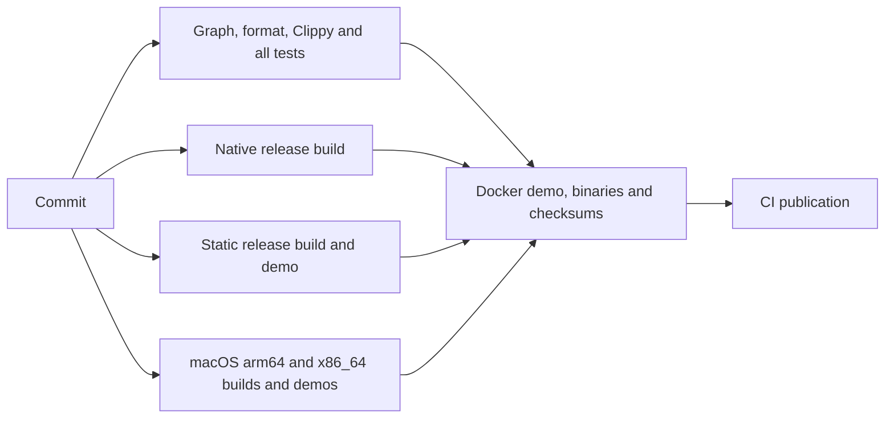

# CI execution, parallel tests and build reuse

Validation runs only in GitHub Actions. Never run tests, lint, builds, binaries,
demos or browser previews locally. Formatting edits are allowed. Commit changes,
push the completed work, inspect every required job and fix failures in new
commits. GitHub Actions alone creates tags/releases/assets.

## Independent work and publication gates

Validation and four build targets run concurrently on separate runners. The
build matrix retains native GNU and static musl coverage and adds native Apple
Silicon and Intel builds on standard `macos-26` and `macos-26-intel` runners.
macOS binaries must have the exact target architecture and pass the local
acquisition/import/Plex demo on their native runner. No larger paid runner is
selected. Packaging waits for validation and every build to succeed for the
same workflow commit; publication waits for successful packaging.
PR runs validate/build/package but cannot publish.

Same-run macOS artifacts include the target and exact source SHA in their names.
Packaging checks byte-for-byte preservation, executable modes and release
checksums. The three executables and one manifest are the only release assets.
The checked image is retained for one day as a source-SHA-scoped Actions artifact,
then published to private GHCR only by the successful default release job. `.github/engineering.json` requires both Mac
build job names in addition to the original Linux/package/organization gates.

Runs use a noncancelling workflow concurrency group. Complete publication for a
release before pushing its successor; this also preserves runs created from the
earlier workflow definition. Prepare at most one following scope after successful
validation/build/package, and inspect every required job before pushing it. PR runs
also retain their current execution. This policy was added after a queued
publication was cancelled during GitHub's runner-assignment incident. It changes
queue ordering, not the graph/test/build/package/publication gates.

If a historical publication lost its default-branch head and GitHub rejects
release creation because its workflow differs from trunk, retain its exact
validated commit on a source branch before retrying the existing run. The
0.20.4 recovery used release-source/0.20.4 and attempt 4 of run 37362054311.
[GitHub documents the source-ref check](https://github.blog/changelog/2023-11-02-github-actions-enforcing-workflow-scope-when-creating-a-release/).
Retained validation/build/package results remain tied to the original commit;
the retry performs publication only. Actions alone creates tags and assets.

Packaging installs the checked static and native executables without recompiling,
compares their bytes and verifies one SHA-256 manifest. The unused custom ZIP
packaging example is retired; GitHub still provides native source downloads.

The Dockerfile defaults to its existing source build. CI selects the `prebuilt`
stage, assembling the same final scratch image with the checked static binary
and CA trust data. Docker syntax checks also cover the default build choice.
CI extracts `/mynou` from the resulting image and compares it byte-for-byte with
the standalone binary, then runs the existing isolated container demo. Native
and static checks, standalone/container demos, binary permissions and checksum
checks remain required. Published versions stay immutable.

Only the default-branch release job has `packages: write`, alongside its existing
release permission. It uses the ephemeral repository token, private temporary
Docker credentials and the same-run checked image. The original Python std
publisher verifies the exact private repository and private package identity, rejecting reported conflicting repository metadata, permission/network lookup failures,
source/version collisions and mismatched image labels. Existing exact tags are
reused without pushes. It re-pulls the recorded digest, compares the executable
and repeats the isolated container demo before publishing the immutable release.
GHCR tags have no server CAS; deployments pin the recorded content digest.
CI-only publication regressions cover authorization, absence/denial, exact private
repository/package identity, reported foreign links, identity replacement,
collisions, retry reuse, pulled-byte corruption and demonstration failure.
Private-package permission and registry availability require actual default CI;
PR mock checks alone do not establish publication.

## Parallel test harnesses

Cargo already executes tests concurrently within one harness. Its normal
`cargo test --all-targets` invocation runs those harnesses sequentially. CI now
first compiles **all targets once**, retaining Cargo's JSON artifact manifest.
The original [scheduler](../.github/scripts/parallel_tests.py) discovers every
test executable from that successful manifest, including library, binary,
integration and example harnesses. It does not glob a build directory, skip
fresh cached artifacts, filter test cases or maintain a manual target list.
The manifest's complete source-target set must equal the current Cargo metadata
graph. An exact compiled-input cache hit can reuse harness binaries; all tests
still execute. Test builds omit debug symbols to reduce linking/storage overhead;
debug assertions and overflow checks retain their test-profile behavior. Release
build settings are unchanged.

The default process bound is the lesser of four and the runner CPU count. Each
harness uses up to two test threads, giving at most eight concurrent test cases
at the default bounds. Network fixtures may create their own bounded workers.
Temporary directories include process-specific unique identities and listeners
use ephemeral ports. Original assertions and fixture deadlines are unchanged.

Slower harnesses start first, using recorded per-target timing history. Checked-in
initial weights come from the previous green run; successful debug caches can
provide newer weights. Timing history affects ordering only. A malformed history
cannot suppress tests. Concurrency and timeout options can be tuned in CI, with
explicit bounds; this is not permission to execute the scheduler locally.

The checked-in weights cover all 59 harnesses measured by the successful
validation job in [run 37465017605](https://github.com/alecerf/mynou/actions/runs/37465017605),
including native Newznab discovery. That job executed 693 tests in 81.582 seconds
with two processes and two threads per harness. These measurements set scheduling
order for the following scope. New harnesses receive a weight only after a
successful observed run; these durations describe the preceding source.

Each target has a 180-second process deadline by default. A timeout kills its
process group, including CLI fixture children. Remaining harnesses still run
after a failure so CI collects their outcomes. Every target needs a successful
exit and exactly one complete harness summary, with no failed, ignored or
filtered tests. A missing summary or oversized log fails the aggregate.

The runner keeps separate target logs, writes `report.json`, prints grouped logs
and adds a duration table to the Actions job summary. The `mynou-tests-COMMIT`
artifact retains these files for seven days, including failed test results.
Four standard-library scheduler checks exercise discovery, failure propagation,
actual overlap and timeout handling in CI. They are infrastructure checks,
separate from the Rust application test count. CI's existing Python standard
library supplies orchestration; Mynou retains zero Cargo/runtime dependencies.

## Caches

The workflow uses the official `actions/cache` 6.1.0 restore/save actions.
Only successful push jobs on `trunk` save caches; PR runs can restore existing
eligible caches. A cache miss always performs the normal build.

- The test cache is scoped by OS, architecture, repository, Rust version and an
  exact fingerprint of manifests, Cargo configuration/build script, every
  source/test/example file, deployment template and workflow. It retains compiled
  executables, their Cargo manifest and timing history, excluding incremental
  compilation state. There are no partial-key fallbacks. An exact hit avoids
  relinking the same harnesses; the current Cargo target graph still checks
  complete coverage and every test runs. Formatting, Clippy and scheduler checks
  always execute.
- Release caches contain only the target binary. Keys include OS/architecture, Rust version, target, manifests,
  Cargo configuration/build script, every source/example file, embedded
  deployment template and workflow. There
  are no partial-key fallbacks. Only an exact compiler-input match can reuse a
  binary; ELF checks and the standalone demo still run. Source/workflow changes
  invalidate the key. Source-build settings must remain part of this fingerprint
  when new build inputs are introduced.

The caches contain no journal, downloads, library or personal configuration.
Generated Docker input and Python bytecode are excluded from source publication.
Caches support build reuse; they never replace runtime checks or authorize a
release. Previously published tags and assets are not rewritten.

## Timing evidence

The previous green [run 37231391564](https://github.com/alecerf/mynou/actions/runs/37231391564),
at commit `c25da060d94965a9f2aa4926a46962a438b6de17`, recorded 409 passing Rust
tests across 34 harnesses. Its serial validation job took 299 seconds:

| Step | Seconds |
| --- | ---: |
| Tests, including compilation | 101 |
| Test compilation within that step | 25.65 |
| Harness execution, sum of reported durations | 74.98 |
| Native and musl release builds | 74 |
| Docker build/demo/save | 91 |
| Duplicate Rust compilation inside Docker | 74.24 |

The final workflow passed a cold-cache
[run 37234750068](https://github.com/alecerf/mynou/actions/runs/37234750068) and an
exact-cache [run 37235046947](https://github.com/alecerf/mynou/actions/runs/37235046947)
for the same commit, `adb1b27e9827675fd50a54ccef7c4d0c08e681fd`. Both ran all
409 Rust tests across the same 34 harnesses, with no failures, ignored or filtered
tests. Four scheduler checks passed in each run. These runners used two harness
processes with two threads each. Every dependency, format, Clippy, native/static,
standalone/container demo, archive and checksum check passed. Publication remained
gated and retained the existing 0.15 release.

| Observed duration | Previous workflow | Optimized, cold cache | Optimized, exact cache |
| --- | ---: | ---: | ---: |
| Test compilation | 25.65 s | 17.21 s | Reused |
| Rust harness execution | 74.98 s | 37.160 s | 36.045 s |
| Validation job | 299 s | 85 s | 64 s |
| Docker build/demo/save | 91 s | 15 s | 16 s |
| Entire workflow, creation through completion | 313 s | 142 s | 117 s |

Whole-workflow time fell by approximately 55% cold and 63% with exact caches in
this comparison. Harness execution fell by approximately 52% in the exact-cache
run. The warm native/static jobs took six/seven seconds, including repeated ELF
and static-demo checks; compiler installation and builds were reused. The 61 MiB
test cache restored in three seconds and skipped test compilation while executing
every harness and checking its coverage against the current target graph.

Validation job time is not the whole optimized workflow: builds now run
independently and packaging/publication follow them. General debug-directory
caching was measured before the exact-cache refinement: it restored 274 MiB in
13 seconds but still rebuilt the tests. Exact input keys and symbol-free test
builds avoid that work. Missing cached example harnesses were caught by manifest
validation, fixed and verified by the successful cold/exact-cache runs above.

Cache downloads, runner load and scheduling affect elapsed time; these are
observed runs, not fixed-duration guarantees. They describe CI duration rather
than application throughput or general performance. Later commits need their
own completed workflow, including documentation-only changes, and cannot rewrite
previously published tags or assets.

[Validation](validation.md) · [Dependencies](dependencies.md) ·
[Performance](performance.md) · [Next feature release](next-release.md)

The v0.22.2 run completed all 57 harnesses with 663 passing Rust tests in
79.506 seconds. Its workspace harness took 18.445 seconds, including the original
65 MiB fixture. Weights now contain these actual measurements; the new queue
harness uses the scheduler default until its first completed passing run.

## Optional source formatting branches

The `format/**` branch namespace runs an editing-only workflow with Rust 1.99.0
rustfmt. The bot commits formatting edits through a regular fast-forward push.
This supports source edits when the execution workspace is unavailable. It does
not validate source or publish a release. A completed scope still reaches trunk
and passes the original graph, formatting, Clippy, scheduler, all-target test,
build, packaging and publication gates for its exact source commit.

The v0.22.5 run completed all 60 harnesses with 712 passing Rust tests in
77.994 seconds. The held-owner harness took 2.017 seconds; these actual timings
now guide scheduling. The expanded native Newznab/library harness retains its
preceding observed weight until its own completed run provides a measurement.
No new performance estimate replaces observed history.

The v0.22.6 run completed all 60 harnesses with 729 passing Rust tests in
93.111 seconds. The timing manifest now records this completed run, including
the expanded native Newznab/library target. The new archive target uses the
scheduler default until its first passing observation. Parallelism remains two
harness processes with two test threads each; every current target is required.

The v0.22.7 run completed all 61 harnesses with 750 passing Rust tests in
89.003 seconds. The archive format target took 0.566 seconds and native
Newznab/library target 11.903 seconds. The timing manifest records these actual
measurements; expanded v0.22.8 targets retain preceding weights until their own
completed run provides observations. All targets and gates remain required.

The v0.22.8 run completed all 61 harnesses with 773 passing Rust tests in
95.048 seconds. The manifest now records this run's actual observations, including
expanded ZIP library/recovery fixtures. The new RAR target uses the scheduler
default until its own completed passing run. All targets remain required.

The v0.22.9 run completed 62 harnesses with 791 Rust tests in 97.770 seconds.
Its RAR format target took 0.114 seconds; the manifest records every observed
target duration from that completed run. Expanded native admission fixtures retain
preceding weights until their own passing measurements. All gates remain enabled.

## Registry publication recovery

[Default CI37704415292](https://github.com/alecerf/mynou/actions/runs/37704415292)
attempts1/2 failed the assumed repository-link field. A bounded read-only PR probe
([run37713788379](https://github.com/alecerf/mynou/actions/runs/37713788379),
job113105507230) observed a private correctly named/owned container package, one
complete version page and both `0.22.17`/`sha-551e82d2c4158b9af2080081bbac3e1d18c949ea`
tags at digest `sha256:675ef89d1bed913973e7682e9633e8fb3b229eecc5d98dc8a132f1b49af2040c`.
Its native metadata had no repository fields. This is not proof of an unlinked
package, public visibility, denied access or a complete published release.

From proposed0.22.18 the publisher checks the private native source repository
name/ID against GitHub's exact workflow repository name/ID. It requires the
private native package owner/name/type and a stable positive package ID before
and after writes. Reported foreign or malformed repository metadata still blocks
publication. An omitted optional association is recorded as `not_exposed`, not
claimed as a server/UI link. Scoped-token authorization and the original pulled
source/revision/version/runtime/digest/binary/demo checks remain mandatory.
The [REST package reference](https://docs.github.com/en/rest/packages/packages#get-a-package-for-a-user)
does not guarantee repository fields for granular container packages;
[GraphQL](https://docs.github.com/en/packages/learn-github-packages/introduction-to-github-packages#managing-packages)
does not support that registry. No unsupported lookup or visibility change is used.

The temporary PR probe and its one-off helper are retired after retaining their
actual CI proof. New source uses0.22.18; existing0.22.17 source/version images and
all earlier immutable releases remain unchanged. Actual default private package,
verified content digest and immutable four-asset release are required to finish
Issue #18. No repeated unchanged rerun, local validation or manual publication.

## Container verification cleanup

Default [CI 37715379732](https://github.com/alecerf/mynou/actions/runs/37715379732)
at `ebc0a6fe1098b5cfb8d3e7c60e0b902b61a09114` passed all six validation,
native build and package jobs. Release job 113111514725 verified the private
package ID 15695108, source repository ID 1403318143, pulled executable SHA
and isolated demonstration at image digest
`sha256:991a217cd046c00697b975bff35b4bc23d4f7a85f0b4d14b90cd904684c7cf68`.
It then failed removing the synthetic bind-mounted tree owned by the container's
configured UID 1000. GitHub release v0.22.18 was absent; image verification was
not a successful release. The existing 0.22.17 and 0.22.18 images are preserved.

The shared CI-only verification helper runs with the nonroot runner's effective
UID/GID against its own private temporary mount, retaining read-only root,
network isolation, dropped capabilities and no new privileges. It refuses root
UID/GID and reports completion only after removing synthetic files. Package CI
exercises this exact cleanup path on PRs without publication permissions, in
addition to the unchanged configured-user 1000 demonstration. Image inspection
still requires the production `1000:1000` policy; this verification-only UID
override does not change image or installation defaults.

Publication proof and Actions output are written only after demo and credential
workspaces have been cleaned successfully. CI regression cases cover private
mount ownership/removal, root refusal, cleanup failure without announcement and
the read-only local-image selector. No privileged cleanup or ignored errors.
Fresh 0.22.19 source/version avoids replacing the already observed images.
Actual green default CI, private digest verification and the immutable four-asset
release remain required to complete Issue #18; PR checks alone do not publish.
