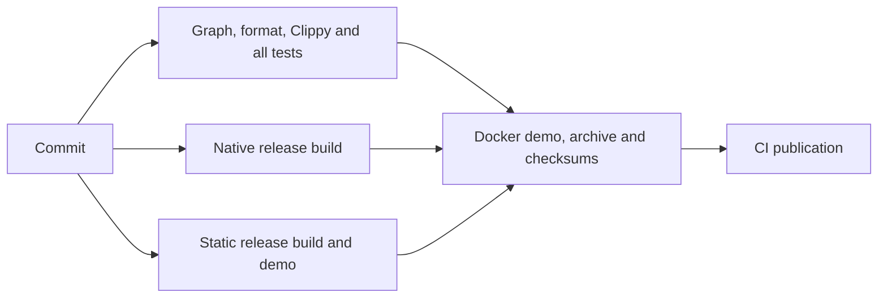

# CI execution, parallel tests and build reuse

Validation runs only in GitHub Actions. Never run tests, lint, builds, binaries,
demos or browser previews locally. Formatting edits are allowed. Commit changes,
push the completed work, inspect every required job and fix failures in new
commits. GitHub Actions alone creates tags/releases/assets.

## Independent work and publication gates

Validation and both build targets run concurrently on separate runners. The
build matrix retains native GNU and static musl coverage. Packaging waits for
all three jobs to succeed for the same workflow commit; publication waits for
successful packaging. PR runs validate/build/package but cannot publish.

The static build also compiles the Rust standard-library-only packaging example.
The next job receives that tool and the checked binary as a workflow artifact,
so neither is recompiled for packaging. It explicitly passes the current source
checkout to the packaging tool, independent of the build runner's directory.

The Dockerfile defaults to its existing source build. CI selects the `prebuilt`
stage, assembling the same final scratch image with the checked static binary
and CA trust data. Docker syntax checks also cover the default build choice.
CI extracts `/mynou` from the resulting image and compares it byte-for-byte with
the standalone binary, then runs the existing isolated container demo. Native
and static checks, standalone/container demos, ZIP integrity, binary permissions
and all checksum checks remain required. Published versions stay immutable.

## Parallel test harnesses

Cargo already executes tests concurrently within one harness. Its normal
`cargo test --all-targets` invocation runs those harnesses sequentially. CI now
first compiles **all targets once**, retaining Cargo's JSON artifact manifest.
The original [scheduler](../.github/scripts/parallel_tests.py) discovers every
test executable from that successful manifest, including library, binary,
integration and example harnesses. It does not glob a build directory, skip
fresh cached artifacts, filter test cases or maintain a manual target list.
The manifest's complete source-target set must equal the current Cargo metadata
graph. An exact compiled-input cache hit can reuse harness binaries; all tests
still execute. Test builds omit debug symbols to reduce linking/storage overhead;
debug assertions and overflow checks retain their test-profile behavior. Release
build settings are unchanged.

The default process bound is the lesser of four and the runner CPU count. Each
harness uses up to two test threads, giving at most eight concurrent test cases
at the default bounds. Network fixtures may create their own bounded workers.
Temporary directories include process-specific unique identities and listeners
use ephemeral ports. Original assertions and fixture deadlines are unchanged.

Slower harnesses start first, using recorded per-target timing history. Checked-in
initial weights come from the previous green run; successful debug caches can
provide newer weights. Timing history affects ordering only. A malformed history
cannot suppress tests. Concurrency and timeout options can be tuned in CI, with
explicit bounds; this is not permission to execute the scheduler locally.

Each target has a 180-second process deadline by default. A timeout kills its
process group, including CLI fixture children. Remaining harnesses still run
after a failure so CI collects their outcomes. Every target needs a successful
exit and exactly one complete harness summary, with no failed, ignored or
filtered tests. A missing summary or oversized log fails the aggregate.

The runner keeps separate target logs, writes `report.json`, prints grouped logs
and adds a duration table to the Actions job summary. The `mynou-tests-COMMIT`
artifact retains these files for seven days, including failed test results.
Four standard-library scheduler checks exercise discovery, failure propagation,
actual overlap and timeout handling in CI. They are infrastructure checks,
separate from the Rust application test count. CI's existing Python standard
library supplies orchestration; Mynou retains zero Cargo/runtime dependencies.

## Caches

The workflow uses the official `actions/cache` 6.1.0 restore/save actions.
Only successful push jobs on `trunk` save caches; PR runs can restore existing
eligible caches. A cache miss always performs the normal build.

- The test cache is scoped by OS, architecture, repository, Rust version and an
  exact fingerprint of manifests, Cargo configuration/build script, every
  source/test/example file, deployment template and workflow. It retains compiled
  executables, their Cargo manifest and timing history, excluding incremental
  compilation state. There are no partial-key fallbacks. An exact hit avoids
  relinking the same harnesses; the current Cargo target graph still checks
  complete coverage and every test runs. Formatting, Clippy and scheduler checks
  always execute.
- Release caches contain only the target binary and, for musl, the packaging
  executable. Keys include OS/architecture, Rust version, target, manifests,
  Cargo configuration/build script, every source/example file, embedded
  deployment template and workflow. There
  are no partial-key fallbacks. Only an exact compiler-input match can reuse a
  binary; ELF checks and the standalone demo still run. Source/workflow changes
  invalidate the key. Source-build settings must remain part of this fingerprint
  when new build inputs are introduced.

The caches contain no journal, downloads, library or personal configuration.
Generated Docker input and Python bytecode are excluded from source publication.
Caches support build reuse; they never replace runtime checks or authorize a
release. Previously published tags and assets are not rewritten.

## Timing evidence

The previous green [run 37231391564](https://github.com/alecerf/mynou/actions/runs/37231391564),
at commit `c25da060d94965a9f2aa4926a46962a438b6de17`, recorded 409 passing Rust
tests across 34 harnesses. Its serial validation job took 299 seconds:

| Step | Seconds |
| --- | ---: |
| Tests, including compilation | 101 |
| Test compilation within that step | 25.65 |
| Harness execution, sum of reported durations | 74.98 |
| Native and musl release builds | 74 |
| Docker build/demo/save | 91 |
| Duplicate Rust compilation inside Docker | 74.24 |

The final workflow passed a cold-cache
[run 37234750068](https://github.com/alecerf/mynou/actions/runs/37234750068) and an
exact-cache [run 37235046947](https://github.com/alecerf/mynou/actions/runs/37235046947)
for the same commit, `adb1b27e9827675fd50a54ccef7c4d0c08e681fd`. Both ran all
409 Rust tests across the same 34 harnesses, with no failures, ignored or filtered
tests. Four scheduler checks passed in each run. These runners used two harness
processes with two threads each. Every dependency, format, Clippy, native/static,
standalone/container demo, archive and checksum check passed. Publication remained
gated and retained the existing 0.15 release.

| Observed duration | Previous workflow | Optimized, cold cache | Optimized, exact cache |
| --- | ---: | ---: | ---: |
| Test compilation | 25.65 s | 17.21 s | Reused |
| Rust harness execution | 74.98 s | 37.160 s | 36.045 s |
| Validation job | 299 s | 85 s | 64 s |
| Docker build/demo/save | 91 s | 15 s | 16 s |
| Entire workflow, creation through completion | 313 s | 142 s | 117 s |

Whole-workflow time fell by approximately 55% cold and 63% with exact caches in
this comparison. Harness execution fell by approximately 52% in the exact-cache
run. The warm native/static jobs took six/seven seconds, including repeated ELF
and static-demo checks; compiler installation and builds were reused. The 61 MiB
test cache restored in three seconds and skipped test compilation while executing
every harness and checking its coverage against the current target graph.

Validation job time is not the whole optimized workflow: builds now run
independently and packaging/publication follow them. General debug-directory
caching was measured before the exact-cache refinement: it restored 274 MiB in
13 seconds but still rebuilt the tests. Exact input keys and symbol-free test
builds avoid that work. Missing cached example harnesses were caught by manifest
validation, fixed and verified by the successful cold/exact-cache runs above.

Cache downloads, runner load and scheduling affect elapsed time; these are
observed runs, not fixed-duration guarantees. They describe CI duration rather
than application throughput or general performance. Later commits need their
own completed workflow, including documentation-only changes, and cannot rewrite
previously published tags or assets.

[Validation](validation.md) · [Dependencies](dependencies.md) ·
[Performance](performance.md) · [Next feature release](next-release.md)
